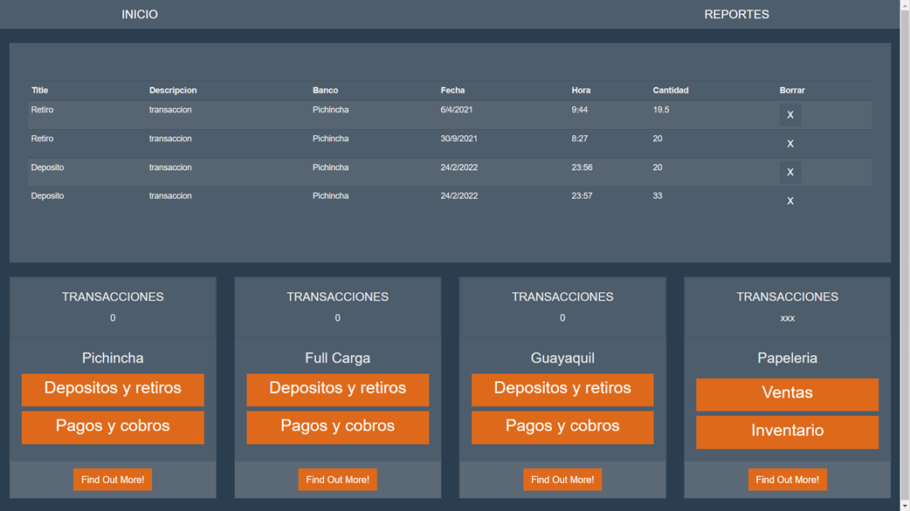

# L & P - A.B.C.

------------


------------

------------

#### Tecnologias utilizadas

- Javascript - Backend and Fronted;
- MongoDB - database;
- NPM  - Manejador de paquetes de javascript ;

------------

#### Paquetes y librerias utilizadas

    NPM - Node Package Manager/
            express/
            express-handlebars/
            fs-extra/
            method-override/
            mongoose/
            morgan/
            timeago-js/
            ...

------------
#### Funcionamiento de las carpetas y archivos

    src/ => Carpeta donde se encuentra todos los archivos de programación
      helpers/ =>
      	auth.js => Archivo para la creaccion de modelo de autenticacion
      models/ =>
	  	Transacciones.js => 
      public/ =>
	  	css/ =>
			main.css => Archivo para defnir los estilos
      routes/ =>
		b_pichincha.js => Archivo para la creaccion de rutas de backend
		full_carga.js => Archivo para la creaccion de rutas de backend
		index.js => Archivo para la creaccion de rutas de backend
		reportes.js => Archivo para la creaccion de rutas de backend
      views/ =>
	  Carpeta donde contiene todos los archivos de fronted
      database.js => Archivo donde se utiliza mongoose para anexar la database de mongodb
      index.js => Archivo de madre de la aplicacion
            ...

------------
#### Scripts
```html
<!-- Desarrollo -->
<script> npm run dev </script>

<!-- Funcionamiento -->
<script> node ./src/index.js </script>
```
